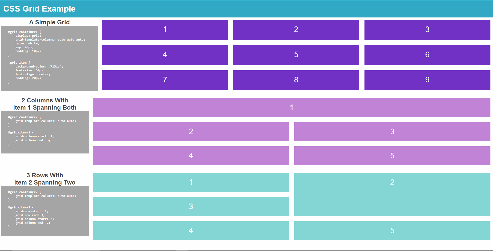

# CSS Grid Demo

Just a simple demonstration of the use of CSS grid. It's a very useful tool and belongs in the toolbox with other solutions like `display`, `position`, `float`, and `flexbox`. Between all of these, there seems to be no layout you can't make in 2020. 

